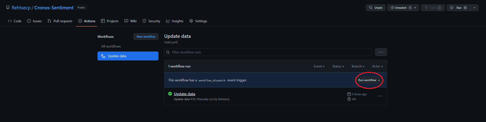
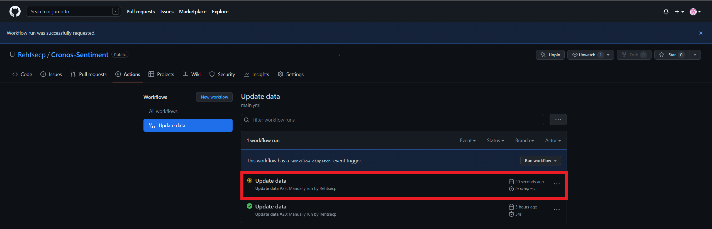
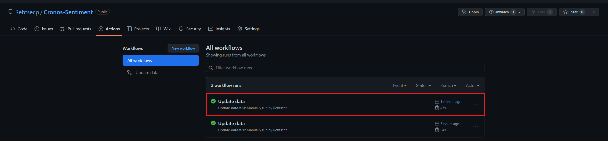

# Cronos-Sentiment

Repository for our automated process of our internship assignment of Epic Data.  
Link to our full project: [Cronos Sentiment Analysis](https://github.com/davidwong19/cronos-sentiment-analyse.git)

## Short Introduction
1. **gd_scraper.py**: Script for scraping, calculating score and assigning sentiment for the new reviews.
2. **check_dup.py**: This python script will check for duplicates, after running above script.
3. **requirements.txt**: A text file containing the required packages for running both scripts, needed for running our workflow.
4. **cronos_reviews.csv**: Our csv file containing all our gathered reviews, from different sources.

## Usage
This is an repository with an GitHub Workflow, accesible via the **Actions** tab.
The workflow is called **'Update data'**, this workflow will check for new reviews **every sunday at 00:00**.

### Running the workflow manually
1. Go to [Actions](https://github.com/Rehtsecp/Cronos-Sentiment/actions/workflows/main.yml)
2. Click on **Run workflow**

3. Click on **Run workflow**, once more

5. After waiting a couple seconds, you'll see an orange loading icon, that means the process is starting

Wait a max. of 1 minute to allow it to complete the whole process of scraping, assigning score/sentiment and to update the csv file.

Now you should be able to find the new reviews in **cronos_reviews.csv**.
